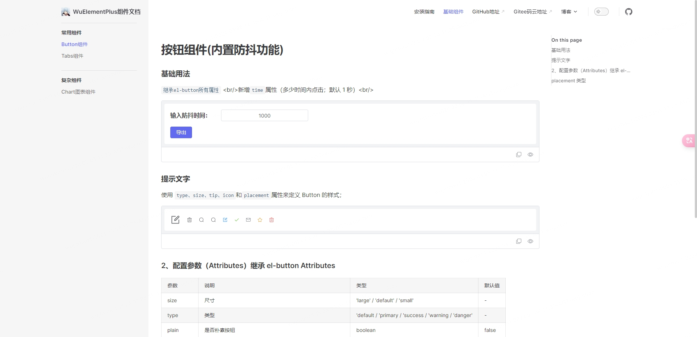

# Wu-Element-Plus

## 介绍

> 基于 vue3+ ts+ Element-plus 二次封装组件

这是我在学习 Vue3 中基于[Element-plus](https://element-plus.org/zh-CN/) 二次封装组件文档，希望对你有用。可查看 [详细组件案例文档](https://Wukingbow.github.io/wu-element-plus/) 预览

<p align="center">
  <a href="https://github.com/vuejs/vue" target="_blank">
    
  </a>
  <a href="https://gitee.com/wujinbao/wu-element-plus/stargazers" target="_blank">
    
  </a>
   <a href="https://github.com/Wukingbow/wu-element-plus/stargazers" target="_blank">
    
  </a>
   <a href="https://www.npmjs.com/package/@Wukingbow/wu-element-plus" target="_blank">
      
    </a>
</p>

## 动态效果图



## npm 方式安装使用

```shell
npm i @Wukingbow/wu-element-plus
```

## 全局注册使用

> ### 前提条件：使用项目必须全局注册 Element-plus组件库

```js
// 在main.js中按下引入
import WuElementPlus from '@Wukingbow/wu-element-plus'
import '@Wukingbow/wu-element-plus/lib/style.css'
Vue.use(WuElementPlus)
```

## 按需引入

```js
// 在main.js中按下引入
import '@Wukingbow/wu-element-plus/lib/style.css'
// 单个.vue文件引入
<script setup lang="ts">
  import {WuButton, WuTabs} from "@Wukingbow/wu-element-plus"
</script>
```

## wu-element-plus Volar 组件类型提示

```js
// 需要在使用的项目的tsconfig.json文件中添加以下
compilerOptions：{
  "types": [
      "@Wukingbow/wu-element-plus/components.d.ts",
    ],
}

```
## Vue3 + Vite项目中安装引入报如下错误的解决方法
> #### 把项目的vite版本升级到4+


## 安装依赖
> ### 注意: 本地环境版本最好安装 [Node.js 16.x+](https://nodejs.org/en)、[pnpm 7.x+](https://github.com/pnpm/pnpm/)

```shell
npm install -g pnpm

pnpm install

```

## 使用[wu-element-plus组件的后台管理系统地址](https://github.com/Wukingbow/Wukingbow-admin)

## 本地运行 vuepress 中组件文档

```shell
// docs项目(文档demo示例)基于vue3+vite项目
npm run docs:dev

```

## Thanks to all the contributors

<a href="https://github.com/Wukingbow/wu-element-plus/graphs/contributors">
  
</a>

## Git 提交规范

- `ci`: ci 配置文件和脚本的变动;
- `chore`: 构建系统或辅助工具的变动;
- `fix`: 代码 BUG 修复;
- `feat`: 新功能;
- `perf`: 性能优化和提升;
- `refactor`: 仅仅是代码变动，既不是修复 BUG 也不是引入新功能;
- `style`: 代码格式调整，可能是空格、分号、缩进等等;
- `docs`: 文档变动;
- `test`: 补充缺失的测试用例或者修正现有的测试用例;
- `revert`: 回滚操作;
