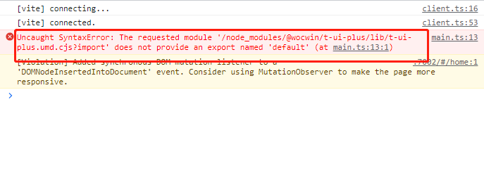

### 快速上手

::: tip 提示

@Wukingbow/wu-element-plus 基于 vue3 + ts + Element-plus 再次封装的组件

:::

### 安装

```bash:no-line-numbers
npm install @Wukingbow/wu-element-plus -S
&
pnpm add @Wukingbow/wu-element-plus -S
```


### 使用
> #### 前提条件：使用项目必须全局注册 Element-plus组件库

```js
// main.ts
import WuElementPlus from '@Wukingbow/wu-element-plus'
import '@Wukingbow/wu-element-plus/lib/style.css'
const app = createApp(App)
app.use(WuElementPlus)
app.mount('#app')
```

### Wu-Element-Plus组件 Volar 类型提示

```js
// 需要在使用的项目的tsconfig.json文件中添加以下
compilerOptions：{
  "types": [
      "@Wukingbow/wu-element-plus/components.d.ts",
    ],
}

```

### 🔨  Vue3 + Vite项目中安装引入报如下错误的解决方法
> #### 把项目的vite版本升级到4+



### docs文档结构目录
```
├─ examples               # VPDemo组件自动解析此文件夹下的所有.vue文件
├─ components             # .md文件
├─ public                 # 静态资源文件
├─ .vitepress
│  ├─ config              # 插件配置
|  │  ├─ global.ts        # 全局变量定义
|  │  └─ plugins.ts       # 自定义.md文件渲染
│  ├─ theme               # 主题配置
│  ├─ utils               # 文档展开隐藏代码高亮
│  ├─ vitepress
|  │  ├─ vp-demo          # VPDemo组件源码
|  │  ├─ style            # VPDemo组件样式
|  │  └─ index.ts         # 暴露VPDemo组件
│  └─ config.ts           # vitepress配置文件
├─ index.md               # 文档home页面
├─ tsconfig.json          # typescript 全局配置
└─ vite.config.ts         # vite 全局配置文件（支持tsx）
```

### Git 提交规范（PR提交规范）

- `ci`: ci 配置文件和脚本的变动;
- `chore`: 构建系统或辅助工具的变动;
- `fix`: 代码 BUG 修复;
- `feat`: 新功能;
- `perf`: 性能优化和提升;
- `refactor`: 仅仅是代码变动，既不是修复 BUG 也不是引入新功能;
- `style`: 代码格式调整，可能是空格、分号、缩进等等;
- `docs`: 文档变动;
- `test`: 补充缺失的测试用例或者修正现有的测试用例;
- `revert`: 回滚操作;

